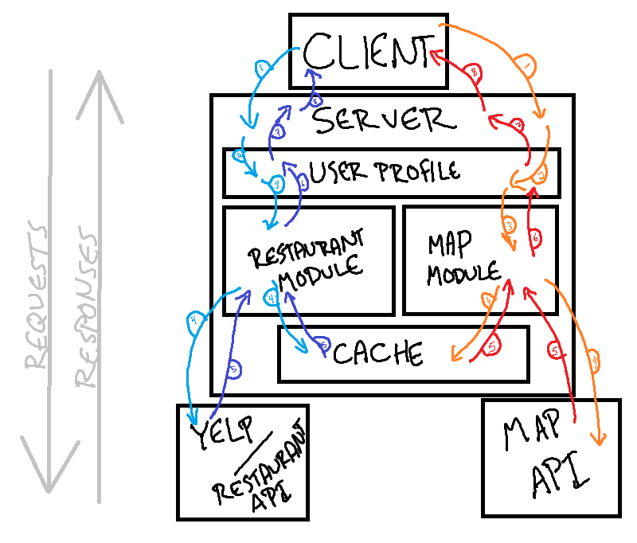

# theTABLE (client)

## Authors: Sarah Creager, Justin Hamerly, Christopher Burk, Haustin Kimbrough

## Version: 1.0.0

## Description

theTABLE is an app that allows you to track the restaurants you have gone to and your recommended items. You will also be able to see your friend's recommended dishes and restaurants on your feed and personal map. The app will track your most frequented restaurants as well as offer recommendations from friends for other restaurants and food items. It is a social media, info feed for foodies and hungry people who need some inspiration on where to go tonight.

## Resources and Contributions

## Change Log

## Domain Model

## Wireframe

## Database Schema Diagram

## User Stories

### LOGIN FEATURE

As a restaurant goer, I need to easily access the application so I can successfully decide on a restaurant that fits my taste.

Feature Tasks:

- User clicks a login button to enter credentials through Auth0

- Once user logs in successfully a logout button will appear.

Acceptance:

- When user clicks login button, Auth0 form will render.

- Once user successfully logs in, profile information will appear.

- Logout button will conditionally render once user is logged in.

### ADD A RESTAURANTE FEATURE

As a user, I want to input previous restaurant experiences so I can track what restaurants I’ve been to and what dish was my favorite.

Feature Tasks:

- User clicks a check in button to track the restaurants they've visited.

- User can upload a photo and name of favorite dish at the restaurant.

Acceptance:

- When user clicks the check-in button, the tally for visits to that current restaurant increases.

- User is able to upload a picture and name of their favorite dish which saves to their favorites page.

### ADD A MAP THAT DISPLAYS PREVIOUSLY VISITED RESTAURANTS

As a user, I want to view the restaurants I’ve already visited so I can easily make a selection if I don’t want to eat somewhere new.

Feature Tasks:

- Map will display pins of user’s previously visited restaurants.

- Pin will be a unique color.

- Pin size will vary based on how many times they’ve visited the restaurant.

Acceptance:

- When user clicks the map it will show the pins of all the restaurants they have previously visited.

- The pins will display in a unique color for user’s selections.

- The pins will increase in size every 3 times the restaurant is visited.

### ADD A MAP THAT DISPLAYS FRIEND'S VISITED RESTAURANTS

As a user, I want to view the restaurants my friends have already visited so I can easily make a selection if I want to eat somewhere new recommended from a trusted source.

Feature Tasks:

- Map will display pins of friend's previously visited restaurants.

- Pin will be a unique color.

Acceptance:

- When user clicks the map it will show the pins of all the restaurants friends have previously visited.

- The pins will display in a unique color for friend's selections.

### ADD A MAP THAT DISPLAYS NEARBY RESTAURANTS

As a user, I want to view all the restaurants nearby so I can easily make a selection if I want to explore somewhere new.

Feature Tasks:

- Map will display pins of all nearby restaurants.

- Pin will be a unique color.

Acceptance:

- When user clicks the map it will show the pins of all the nearby restaurants in the area.

- The pins will display in a unique color.

### MAP TOGGLES BETWEEN VIEWS

As a user, I want to toggle between my restaurant pins, my friend's pins, and all other nearby restaurant pins on the map so I can easily make a selection based off of each filtered view.

Feature Tasks:

- User can selected a toggle option on map to view their restaurant pins, their friend's pins, or all other restaurants in the area.

Acceptance:

- When user clicks the toggle button on the map, it will filter the pins on the map to their selection.
